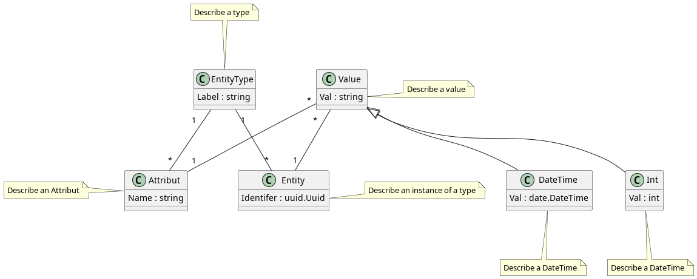

***No English Version: At the time of writing, this project was owned and operated by a French company called Orness. The documentation was therefore written in French.***

# Le patern EAV

Nous allons utiliser ici un le pattern EAV. Cependant, l'usage que nous allons en faire est "non standard" au vu de ce qu'il se fait habituellement avec ce pattern.

Évidemment, il faudra décliner les différents types avec 